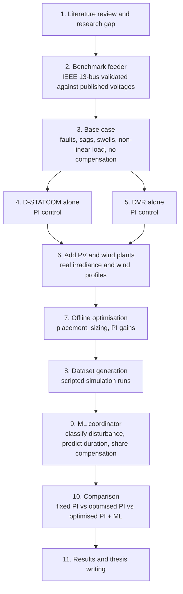
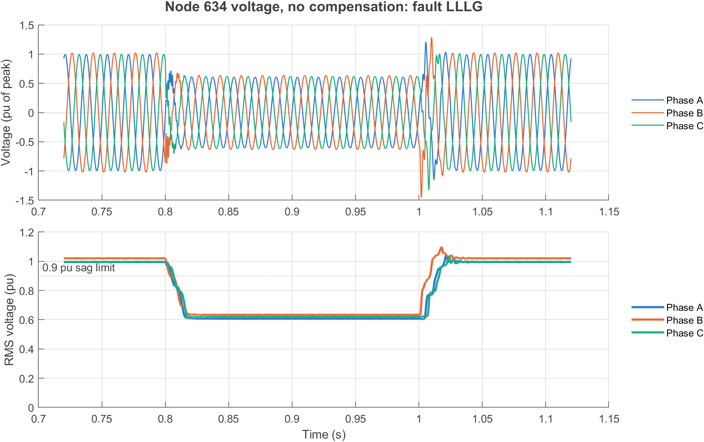
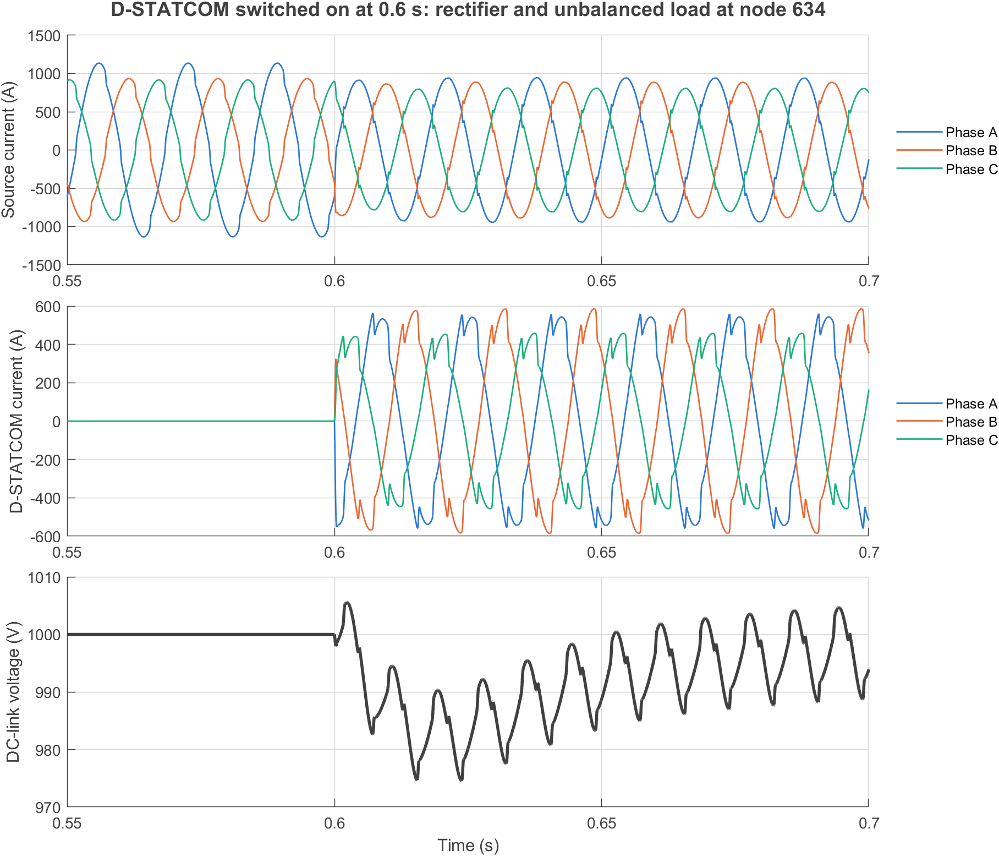
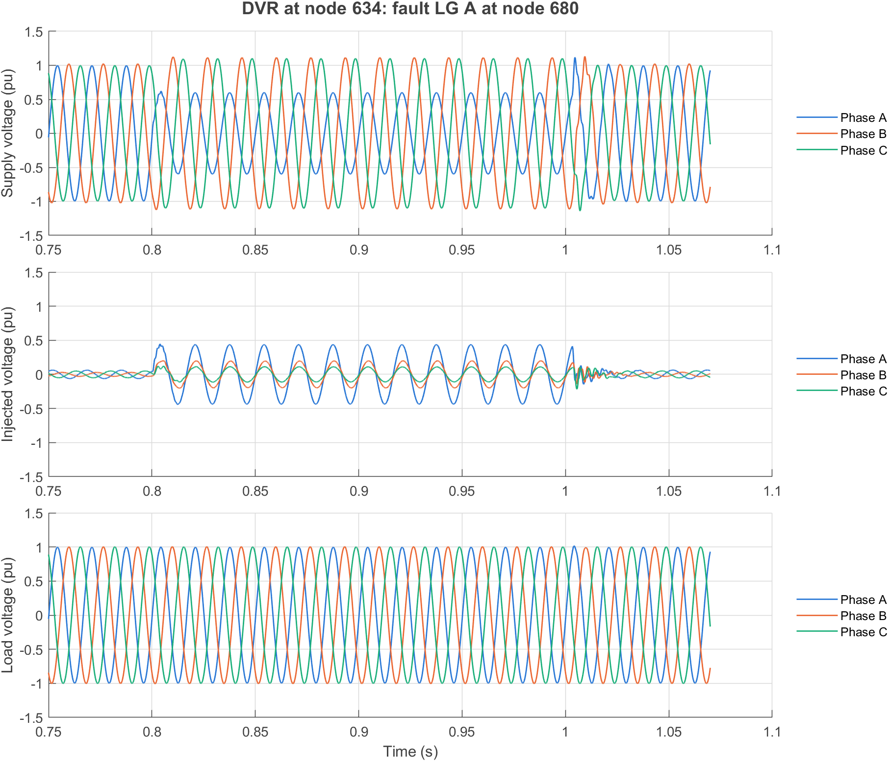
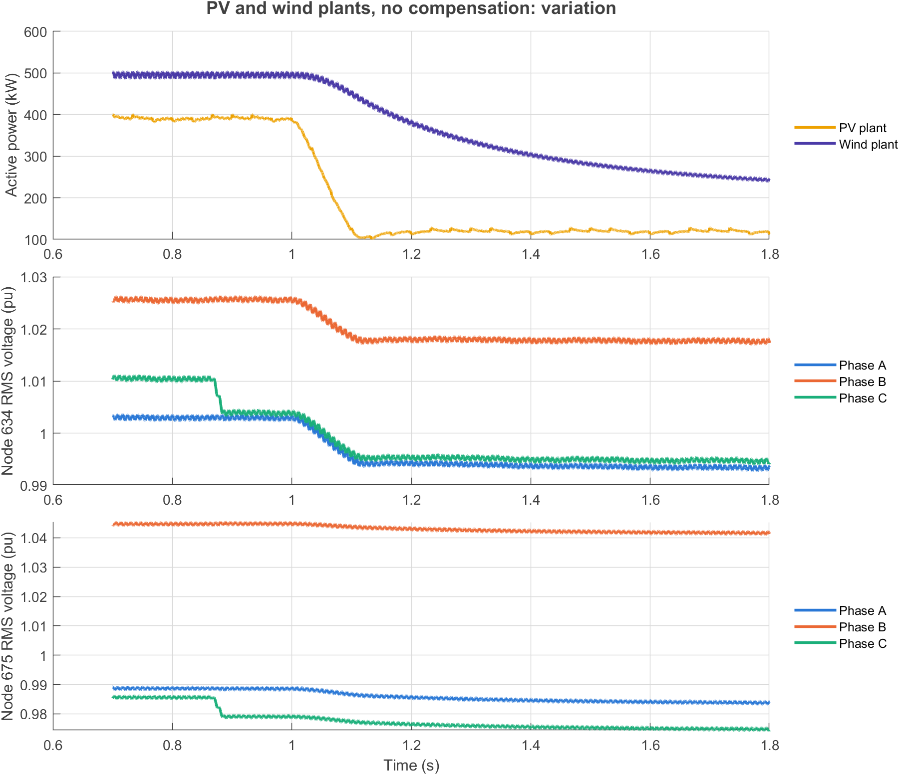
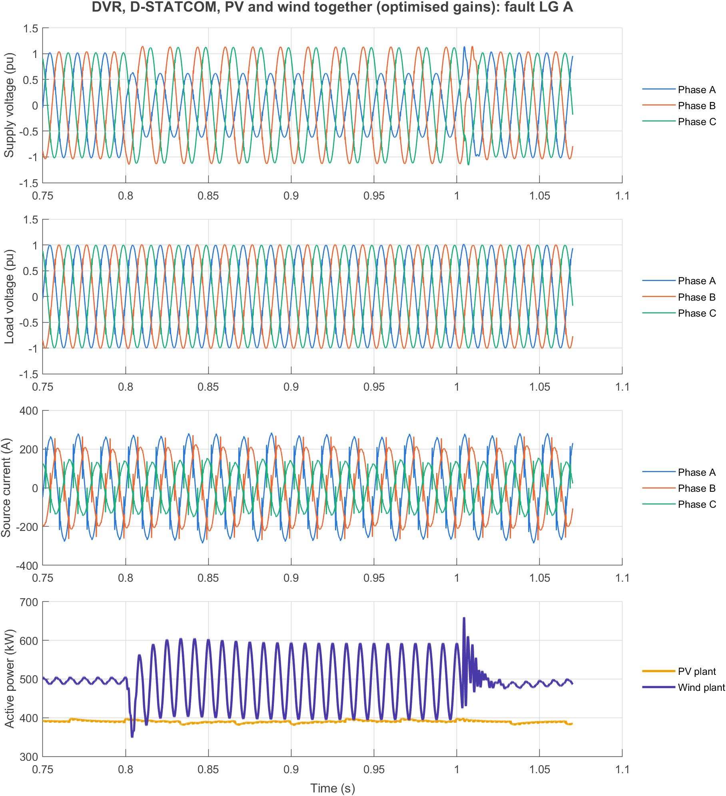
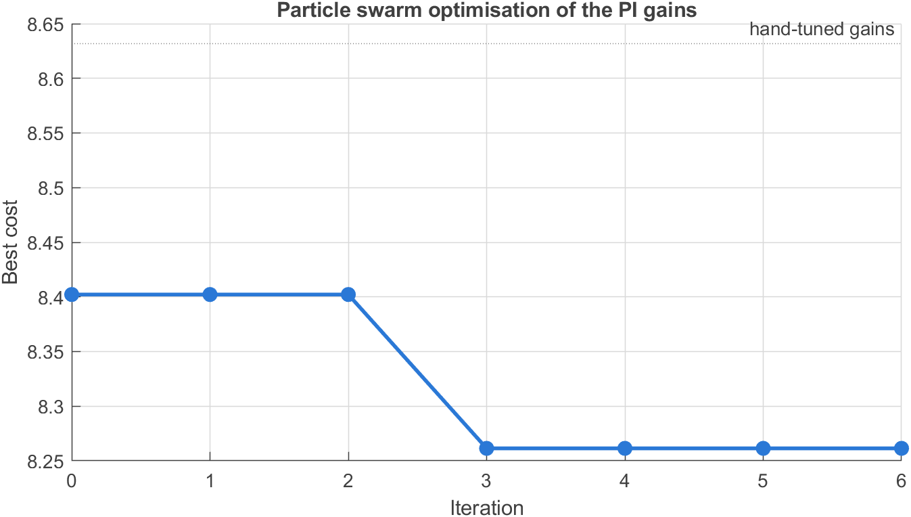

# DVR and D-STATCOM with Hybrid PV-Wind Distributed Generation

Coordinated control of a Dynamic Voltage Restorer (DVR) and a Distribution
Static Compensator (D-STATCOM) for power quality improvement in a distribution
feeder with both solar PV and wind generation, using optimisation and machine
learning. Modelled in MATLAB/Simulink on the IEEE 13-bus test feeder.

## Research gap

Existing studies cover only part of the problem:

- DVR and D-STATCOM are compared with a single source (wind only or solar only), not with PV and wind together.
- Where PV and wind are combined, only a DVR is used, with conventional PQ-theory and hysteresis control.
- Intelligent control (fuzzy, deep learning) is applied to one device with one source, not to the coordination of both devices.

This work addresses the coordinated operation of both devices with both
sources, with an optimisation and ML layer deciding how they share the
compensation.

## Workflow



| Step | Task | Output | Status |
|---|---|---|---|
| 1 | Literature review and research gap | Gap statement, reference list | In progress (8 papers, more to come) |
| 2 | Validate IEEE 13-bus benchmark model | Node voltages within 0.01 pu of benchmark | Done |
| 3 | Base case with faults and non-linear load | Uncompensated sag, THD and unbalance at the sensitive load bus | Done |
| 4 | D-STATCOM alone with PI control | Voltage regulation, THD, reactive power | Done |
| 5 | DVR alone with PI control | Restored load voltage, injected voltage and energy | Done |
| 6 | Add PV and wind plants | Feeder with hybrid DG under varying irradiance and wind | Done |
| 7 | Combined model and offline optimisation (PSO) | Device location, rating and PI gains | Partly done: combined model built and PI gains optimised; location and rating not yet |
| 8 | Dataset generation | Labelled disturbance cases from scripted runs | To do |
| 9 | ML coordinator | Trained model, accuracy and inference time | To do |
| 10 | Comparison of the three control cases | Tables and waveforms for all scenarios | To do |
| 11 | Writing | Thesis and paper | To do |

### Test scenarios

- Balanced and unbalanced voltage sags and swells
- Single-phase and three-phase faults
- Non-linear load (harmonics)
- Step and real-profile changes in irradiance and wind speed

### Performance metrics

- Load voltage restoration and response time
- Total harmonic distortion (IEEE 519)
- Voltage unbalance
- Injected kVA and storage energy
- Low-voltage ride-through compliance (IEEE 1547-2018)
- ML accuracy and inference time (target: within a quarter to half cycle)

## Base-case results (no compensation)

Fault at node 680 from 0.8 s to 1.0 s (fault resistance 0.01 ohm). Voltages are
fundamental RMS at node 634, the 480 V load behind the transformer, measured
during the disturbance.

| Scenario | Va (pu) | Vb (pu) | Vc (pu) | Unbalance (%) | Voltage THD (%) |
|---|---|---|---|---|---|
| Normal operation | 0.995 | 1.020 | 0.996 | 0.6 | 0.0 |
| Three-phase-to-ground fault | 0.607 | 0.634 | 0.620 | 2.9 | 0.0 |
| Single line-to-ground fault (A) | 0.613 | 1.104 | 1.097 | 8.9 | 0.0 |
| Line-to-line fault (B-C) | 0.983 | 0.730 | 0.740 | 24.1 | 0.0 |
| Double line-to-ground fault (B-C) | 1.102 | 0.619 | 0.617 | 21.8 | 0.0 |
| Non-linear load (100 kW rectifier at 634) | 0.991 | 1.017 | 0.993 | 0.6 | 2.0 |

Faults give sags down to about 0.61 pu, and ground faults also give swells of
about 1.10 pu on the healthy phases. Full results for nodes 632, 634 and 671
are in `results/basecase_summary.csv`.



To reproduce, in MATLAB from the repository root:

```matlab
addpath('scripts'); build_basecase; run_basecase;
```

## D-STATCOM results (PI control, no DVR)

A 500 kVA D-STATCOM is connected at node 634 (480 V) and switched on at 0.6 s.
Control is in the synchronous reference frame: a PLL, PI regulators for the
DC-link voltage, the AC voltage and the two current components. The converter
is an averaged model (no switching), with the DC link represented by its power
balance.

**Load compensation** (unbalanced load plus 100 kW rectifier), measured on the
source side of node 634:

| Quantity | Without D-STATCOM | With D-STATCOM |
|---|---|---|
| Power factor | 0.860 | 1.000 |
| Reactive power from source (kvar) | 295.8 | -0.5 |
| Source current THD, worst phase (%) | 5.1 | 2.7 |
| Source current unbalance (%) | 7.1 | 0.7 |
| Mean source current (A rms) | 698 | 621 |
| Voltage THD at 634, worst phase (%) | 2.0 | 1.6 |

The DC-link voltage stays between 975 V and 1008 V around its 1000 V reference.



**Voltage support during faults** (voltage regulation mode, fault at node 680):

| Fault | Phase | Without D-STATCOM (pu) | With D-STATCOM (pu) |
|---|---|---|---|
| Three-phase-to-ground | A / B / C | 0.607 / 0.634 / 0.620 | 0.631 / 0.659 / 0.642 |
| Single line-to-ground (A) | A / B / C | 0.613 / 1.104 / 1.097 | 0.636 / 1.133 / 1.123 |

At its current limit (about 600 A rms) the D-STATCOM raises the sagged voltage
by only about 0.02 pu, and in the single-phase fault it also raises the swell
on the healthy phases. A shunt device of this rating cannot restore a deep sag
caused by an upstream fault, which is the case for adding the series DVR in
step 5.

Full results are in `results/dstatcom_summary.csv`. To reproduce:

```matlab
addpath('scripts'); build_basecase; build_dstatcom; run_dstatcom;
```

## DVR results (PI control, no D-STATCOM)

A DVR is connected in series between the transformer and node 634 and
enabled at 0.6 s. It injects the difference between a 1.0 pu reference and the
measured supply voltage (feed-forward), with PI regulators in the synchronous
reference frame trimming the load voltage. The injection limit is 0.5 pu per
phase. The converter is an averaged model (no switching) with ideal energy
storage; the series impedance stands for a 5 % injection transformer.

Load voltage at node 634 during the fault, phases A / B / C:

| Fault at node 680 | Supply side (pu) | Load side with DVR (pu) | Injected (pu) | Mean power (kW) | Energy in 0.2 s (kJ) |
|---|---|---|---|---|---|
| Three-phase-to-ground | 0.594 / 0.627 / 0.610 | 0.996 / 1.003 / 1.001 | 0.439 / 0.414 / 0.421 | 156.0 | 31.3 |
| Single line-to-ground (A) | 0.598 / 1.112 / 1.099 | 0.996 / 1.003 / 1.001 | 0.436 / 0.199 / 0.110 | 41.8 | 8.4 |
| Line-to-line (B-C) | 0.982 / 0.727 / 0.732 | 0.995 / 1.009 / 0.996 | 0.058 / 0.405 / 0.347 | 74.1 | 14.7 |
| Double line-to-ground (B-C) | 1.107 / 0.608 / 0.607 | 0.995 / 1.006 / 0.999 | 0.086 / 0.431 / 0.422 | 77.6 | 15.4 |

The DVR holds the load within 1 % of nominal in all four faults, including the
swells on the healthy phases, and keeps the load-voltage unbalance below 0.7 %.
The D-STATCOM alone reached only 0.63 pu in the same three-phase fault.

When the DVR is idle its series impedance lowers the load voltage by about
0.03 pu (0.959 / 0.991 / 0.968 pu); once enabled it restores 0.997 / 1.002 /
1.002 pu in normal operation.



Full results are in `results/dvr_summary.csv`. To reproduce:

```matlab
addpath('scripts'); build_basecase; build_dvr; run_dvr;
```

## PV and wind plants (no compensation)

Two inverter-interfaced plants are added to the base-case feeder and connect
at 0.2 s:

| Plant | Rating | Node | Source model |
|---|---|---|---|
| PV | 400 kW, 450 kVA | 634 (480 V) | Array I-V curve, perturb-and-observe MPPT |
| Wind | 500 kW, 550 kVA | 675 (4.16 kV) | Full-converter turbine: Cp(lambda) aerodynamics, one-mass rotor, optimal-torque MPPT, DC chopper |

Both use the same grid-side control: PLL, DC-link voltage PI, current PI loops,
unity power factor, a 1.1 pu current limit, and momentary cessation when the
voltage falls below 0.5 pu (resuming above 0.6 pu). The converters are averaged
models. Together the plants supply about a quarter of the feeder load.

**Resource variation** (irradiance 1000 to 300 W/m2 and wind 12 to 9 m/s, both
ramped between 1.0 s and 1.1 s):

| Quantity | Full output | Reduced output |
|---|---|---|
| PV power (kW) | 393 | 122 |
| Wind power (kW) | 495 | 249 (still falling at 1.8 s) |
| Node 634 voltage, A / B / C (pu) | 1.003 / 1.026 / 1.004 | 0.993 / 1.018 / 0.995 |
| Node 675 voltage, A / B / C (pu) | 0.989 / 1.045 / 0.979 | 0.984 / 1.042 / 0.975 |

Losing about 520 kW of generation moves the voltages by about 0.01 pu, so on
this feeder the DG variation alone is a mild disturbance.



**Faults at node 680** (1.0 s to 1.2 s), voltages are phases A / B / C:

| Fault | Node 634 (pu) | Node 675 (pu) | PV during fault | Wind during fault |
|---|---|---|---|---|
| Three-phase-to-ground | 0.618 / 0.641 / 0.629 | 0.207 / 0.219 / 0.211 | 311 kW, current-limited | 0 kW, ceased |
| Single line-to-ground (A) | 0.622 / 1.109 / 1.107 | 0.213 / 1.229 / 1.194 | 386 kW | 494 kW |

In the three-phase fault the wind plant stops injecting because its node falls
to 0.21 pu, and the PV plant stays connected at its current limit. Both return
to full output after the fault. The DG raises the sag at node 634 only from
0.607 pu to 0.618 pu, so the load still needs the DVR.

The irradiance and wind changes are compressed into a fraction of a second,
and the turbine inertia constant is shortened to 0.5 s, so that they fit a
simulation of one to two seconds. Measured profiles lasting minutes are not
practical at a 50 microsecond step.

Full results are in `results/dg_summary.csv`. To reproduce:

```matlab
addpath('scripts'); build_basecase; build_dg; run_dg;
```

## Combined model: DVR, D-STATCOM, PV and wind together

`IEEE13_full.slx` puts all four devices on the feeder. The D-STATCOM and the PV
plant are on the load side of the DVR, and the rectifier load is on. Devices
switch on at 0.4 s and the fault runs from 0.8 s to 1.0 s. Results below use
the hand-tuned PI gains.

| Fault at node 680 | Supply side A / B / C (pu) | Load side A / B / C (pu) | DVR power (kW) | DVR energy (kJ) | Wind plant |
|---|---|---|---|---|---|
| Three-phase-to-ground | 0.616 / 0.645 / 0.627 | 0.997 / 1.005 / 0.998 | 44.5 | 8.9 | ceased |
| Single line-to-ground (A) | 0.620 / 1.132 / 1.119 | 0.998 / 1.005 / 0.997 | 15.1 | 3.0 | 494 kW |
| Line-to-line (B-C) | 1.008 / 0.747 / 0.749 | 0.996 / 1.012 / 0.992 | 21.6 | 4.3 | 366 kW |
| Double line-to-ground (B-C) | 1.133 / 0.626 / 0.625 | 0.997 / 1.008 / 0.995 | 17.6 | 3.5 | 333 kW |

- The load stays within about 1 % of nominal in every fault and the source
  power factor is 1.000.
- With the PV plant behind it, the DVR needs 44.5 kW in the three-phase fault
  instead of 156 kW when it works alone, about 70 % less, because the PV plant
  supplies most of the load locally.
- The wind plant at node 675 is outside the DVR's protection and still stops
  injecting in the three-phase fault.
- Source current THD reads 19 % because the PV plant leaves only a small
  source current. Measured against the 500 kVA transformer rating the
  distortion is 3.0 %, so both figures are reported.
- Load voltage THD is 3.6 %, higher than with either device alone.



## Optimisation of the PI gains

Particle swarm optimisation (8 particles, 6 iterations, 56 simulations) tunes
five gains on the combined model. Each candidate is scored on one simulation
with a single line-to-ground fault. The cost is

`4 x load-voltage error + voltage THD + current distortion + negative-sequence current + 100 x (1 - power factor) + 0.2 x DC-link deviation`

with every term in percent and the two current terms taken against the
transformer rating. The hand-tuned gains are one of the starting particles.

| Gain | Hand-tuned | Optimised | Search range |
|---|---|---|---|
| D-STATCOM current-loop bandwidth (Hz) | 1500 | 1755 | 500 to 2500 |
| D-STATCOM DC-link Kp (A/V) | 1.0 | 2.35 | 0.2 to 5 |
| D-STATCOM DC-link Ki (A/V/s) | 15 | 105 | 2 to 200 |
| DVR load-voltage Kp | 0.2 | 0.90 | 0 to 0.9 |
| DVR load-voltage Ki | 200 | 20 | 20 to 2000 |

The optimised gains were then tested on all four fault types:

| Quantity | Hand-tuned | Optimised |
|---|---|---|
| Cost, four faults | 8.59 / 8.60 / 9.11 / 8.83 | 8.10 / 8.21 / 8.38 / 8.14 |
| Load voltage THD (%) | 3.55 | 3.01 |
| Negative-sequence source current (% of rating) | 0.74 | 0.65 |
| Source current distortion (% of rating) | 3.02 | 3.05 |
| Load voltage unbalance during fault, four faults (%) | 0.04 / 0.34 / 0.77 / 0.68 | 0.03 / 0.22 / 0.49 / 0.44 |
| DC-link deviation (%) | 1.4 | 1.7 |

The improvement is small: 4 % on the fault used for tuning and 5 to 8 % on the
four test faults. The hand-tuned gains were already close to the best the PI
structure can do here, so the remaining limits are structural (harmonic
tracking of the current loop, and the wind plant outside the DVR) rather than
a matter of tuning. Both DVR gains ended on the edge of their search range,
which means the cost is not sensitive to them and those values should not be
read as an optimum.

A first run without the voltage THD term lowered its cost by 17 % but raised
load voltage THD from 3.55 % to 4.68 %, so the term was added and the run
repeated. Device location and rating have not been optimised.



To reproduce (the optimisation takes about 10 minutes on four cores and needs
the Global Optimization and Parallel Computing toolboxes):

```matlab
addpath('scripts'); build_basecase; build_full; optimise_gains; run_full;
```

## Contents

| File | Description |
|---|---|
| `IEEE13bus_v2019b_Discrete.slx` | IEEE 13-node test feeder, discrete, 60 Hz, 4.16 kV, Ts = 50 µs |
| `IEEE13_basecase.slx` | IEEE 13 feeder with a fault at node 680, a switchable rectifier load at node 634, and waveform logging |
| `scripts/build_basecase.m` | Builds `IEEE13_basecase.slx` from the IEEE 13 model |
| `scripts/run_basecase.m` | Runs the base-case scenarios and writes the summary and figures |
| `IEEE13_dstatcom.slx` | Base-case model plus the D-STATCOM at node 634 and its controller |
| `scripts/build_dstatcom.m` | Builds `IEEE13_dstatcom.slx` |
| `scripts/dstatcom_controller.m` | D-STATCOM control code (copied into the model's MATLAB Function block) |
| `scripts/run_dstatcom.m` | Runs the D-STATCOM scenarios and writes the summary and figures |
| `IEEE13_dvr.slx` | Base-case model plus the series DVR at node 634 and its controller |
| `scripts/build_dvr.m` | Builds `IEEE13_dvr.slx` |
| `scripts/dvr_controller.m` | DVR control code (copied into the model's MATLAB Function block) |
| `scripts/run_dvr.m` | Runs the DVR scenarios and writes the summary and figures |
| `IEEE13_dg.slx` | Base-case model plus the PV plant at node 634 and the wind plant at node 675 |
| `IEEE13_full.slx` | Base-case model plus the DVR, the D-STATCOM, the PV plant and the wind plant |
| `scripts/build_full.m`, `scripts/run_full.m` | Build the combined model; run its four faults with hand-tuned and optimised gains |
| `scripts/optimise_gains.m` | Particle swarm optimisation of the PI gains |
| `scripts/full_input.m`, `scripts/full_metrics.m` | One simulation setup of the combined model, and its performance measures and cost |
| `scripts/add_dvr.m`, `scripts/add_dstatcom.m` | Add the DVR or the D-STATCOM to a model built from the base case |
| `scripts/log_source_current.m` | Logs the source-side current at node 634 |
| `scripts/add_dg.m` | Adds the two plants to a model built from the base case |
| `scripts/build_dg.m` | Builds `IEEE13_dg.slx` |
| `scripts/dg_controller.m` | PV and wind plant models and inverter control (copied into the MATLAB Function blocks) |
| `scripts/run_dg.m` | Runs the DG scenarios and writes the summary and figures |
| `scripts/group_blocks.m` | Groups a device's blocks into one subsystem (`D-STATCOM`, `DVR`, `PV Plant`, `Wind Plant`) |
| `scripts/pq_analyse.m` | Fundamental phasors, THD and unbalance of a three-phase signal |
| `results/` | Summary tables and one figure per scenario |

## Requirements

- MATLAB R2024b (the model was saved in R2019b and opens in later releases)
- Simulink and Simscape Electrical (Specialized Power Systems)
- Step 7: Global Optimization Toolbox and Parallel Computing Toolbox
- Later steps: Deep Learning Toolbox

## Acknowledgement

The IEEE 13-bus Simulink model (`IEEE13bus_v2019b_Discrete.slx`) is the work of
Arun Suresh and Dr. Sukumar Kamalasadan, University of North Carolina at
Charlotte, released under the MIT License (Copyright (c) 2023 Arun Suresh).

## References

1. M. A. Kamarposhti, I. Colak, P. Thounthong, K. Eguchi, "Modeling and Simulation of DVR and D-STATCOM in Presence of Wind Energy System," *Computers, Materials & Continua*, vol. 74, no. 2, 2023. doi:10.32604/cmc.2023.034082
2. J. S. Naick et al., "Performance Analysis of DVR and STATCOM for Power Quality Improvement in Grid-Connected Solar Systems," *IJMTST*, vol. 11, no. 9, pp. 184-193, 2025. doi:10.5281/zenodo.18124614
3. T. O. Prakash, P. S. Puhan, A. Bag, K. Sumanth, "Battery and SMES-Based Dynamic Voltage Restorer Performance Verification Under Various Load Conditions in a Grid-Connected PV-Wind System," in *Sustainable Energy and Technological Advancements*, Springer, 2023. doi:10.1007/978-981-99-4175-9_18
4. M. A. Ahmed, M. A. Bayoumi, "A novel deep learning-based control for voltage sag prediction and DVR-LVRT coordination in grid-connected wind turbine systems," *Ain Shams Engineering Journal*, vol. 17, 103882, 2026.
5. Y. Benatallah, A. Benali, M. Dahane, S. Benali, "Real time fuzzy energy management of hybrid storage systems in DC microgrids with dynamic voltage restorer assisted power quality enhancement," *IJPEDS*, vol. 17, no. 3, pp. 2197-2209, 2026. doi:10.11591/ijpeds.v17.i3.pp2197-2209
6. R. K. Varma, S. A. Rahman, T. Vanderheide, "New Control of PV Solar Farm as STATCOM (PV-STATCOM) for Increasing Grid Power Transmission Limits During Night and Day," *IEEE Trans. Power Delivery*, vol. 30, no. 2, pp. 755-763, 2015.
7. S. Ranjan et al., "Maiden Voltage Control Analysis of Hybrid Power System With Dynamic Voltage Restorer," *IEEE Access*, vol. 9, 2021. doi:10.1109/ACCESS.2021.3071815
8. R. K. Sah, H. Bhusal, N. K. Mahato, B. Tamang, "Impacts of Photovoltaic Penetration on Transient Stability of Power System," *Proc. 11th IOE Graduate Conference*, 2022.
