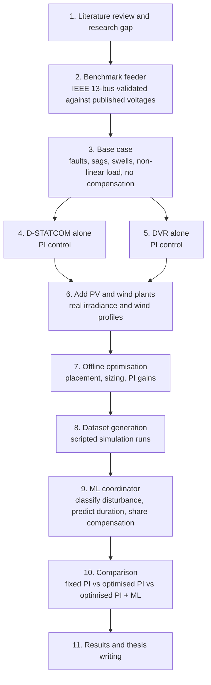

# DVR and D-STATCOM with Hybrid PV-Wind Distributed Generation

Coordinated control of a Dynamic Voltage Restorer (DVR) and a Distribution
Static Compensator (D-STATCOM) for power quality improvement in a distribution
feeder with both solar PV and wind generation, using optimisation and machine
learning. Modelled in MATLAB/Simulink on the IEEE 13-bus test feeder.

## Research gap

Existing studies cover only part of the problem:

- DVR and D-STATCOM are compared with a single source (wind only or solar only), not with PV and wind together.
- Where PV and wind are combined, only a DVR is used, with conventional PQ-theory and hysteresis control.
- Intelligent control (fuzzy, deep learning) is applied to one device with one source, not to the coordination of both devices.

This work addresses the coordinated operation of both devices with both
sources, with an optimisation and ML layer deciding how they share the
compensation.

## Workflow

| Step | Task | Output | Status |
|---|---|---|---|
| 1 | Literature review and research gap | Gap statement, reference list | In progress (8 papers, more to come) |
| 2 | Validate IEEE 13-bus benchmark model | Node voltages within 0.01 pu of benchmark | Done |
| 3 | Base case with faults and non-linear load | Uncompensated sag, THD and unbalance at the sensitive load bus | To do |
| 4 | D-STATCOM alone with PI control | Voltage regulation, THD, reactive power | To do |
| 5 | DVR alone with PI control | Restored load voltage, injected voltage and energy | To do |
| 6 | Add PV and wind plants | Feeder with hybrid DG under varying irradiance and wind | To do |
| 7 | Offline optimisation (PSO or grey wolf) | Device location, rating and PI gains | To do |
| 8 | Dataset generation | Labelled disturbance cases from scripted runs | To do |
| 9 | ML coordinator | Trained model, accuracy and inference time | To do |
| 10 | Comparison of the three control cases | Tables and waveforms for all scenarios | To do |
| 11 | Writing | Thesis and paper | To do |

### Test scenarios

- Balanced and unbalanced voltage sags and swells
- Single-phase and three-phase faults
- Non-linear load (harmonics)
- Step and real-profile changes in irradiance and wind speed

### Performance metrics

- Load voltage restoration and response time
- Total harmonic distortion (IEEE 519)
- Voltage unbalance
- Injected kVA and storage energy
- Low-voltage ride-through compliance (IEEE 1547-2018)
- ML accuracy and inference time (target: within a quarter to half cycle)

## Contents

| File | Description |
|---|---|
| `IEEE13bus_v2019b_Discrete.slx` | IEEE 13-node test feeder, discrete, 60 Hz, 4.16 kV, Ts = 50 µs |
| `LICENSE` | MIT licence for this project |
| `LICENSE-IEEE13-model.txt` | MIT licence of the IEEE 13 model (Arun Suresh, UNC Charlotte) |

## Requirements

- MATLAB R2024b (the model was saved in R2019b and opens in later releases)
- Simulink and Simscape Electrical (Specialized Power Systems)
- Later steps: Global Optimization Toolbox, Deep Learning Toolbox

## License

This project is released under the MIT License, Copyright (c) 2026 Subash
Khanal. See `LICENSE`.

The IEEE 13-bus Simulink model is third-party work by Arun Suresh (University
of North Carolina at Charlotte), also under the MIT License. Its original
notice is kept in `LICENSE-IEEE13-model.txt`.

## References

1. M. A. Kamarposhti, I. Colak, P. Thounthong, K. Eguchi, "Modeling and Simulation of DVR and D-STATCOM in Presence of Wind Energy System," *Computers, Materials & Continua*, vol. 74, no. 2, 2023. doi:10.32604/cmc.2023.034082
2. J. S. Naick et al., "Performance Analysis of DVR and STATCOM for Power Quality Improvement in Grid-Connected Solar Systems," *IJMTST*, vol. 11, no. 9, pp. 184-193, 2025. doi:10.5281/zenodo.18124614
3. T. O. Prakash, P. S. Puhan, A. Bag, K. Sumanth, "Battery and SMES-Based Dynamic Voltage Restorer Performance Verification Under Various Load Conditions in a Grid-Connected PV-Wind System," in *Sustainable Energy and Technological Advancements*, Springer, 2023. doi:10.1007/978-981-99-4175-9_18
4. M. A. Ahmed, M. A. Bayoumi, "A novel deep learning-based control for voltage sag prediction and DVR-LVRT coordination in grid-connected wind turbine systems," *Ain Shams Engineering Journal*, vol. 17, 103882, 2026.
5. Y. Benatallah, A. Benali, M. Dahane, S. Benali, "Real time fuzzy energy management of hybrid storage systems in DC microgrids with dynamic voltage restorer assisted power quality enhancement," *IJPEDS*, vol. 17, no. 3, pp. 2197-2209, 2026. doi:10.11591/ijpeds.v17.i3.pp2197-2209
6. R. K. Varma, S. A. Rahman, T. Vanderheide, "New Control of PV Solar Farm as STATCOM (PV-STATCOM) for Increasing Grid Power Transmission Limits During Night and Day," *IEEE Trans. Power Delivery*, vol. 30, no. 2, pp. 755-763, 2015.
7. S. Ranjan et al., "Maiden Voltage Control Analysis of Hybrid Power System With Dynamic Voltage Restorer," *IEEE Access*, vol. 9, 2021. doi:10.1109/ACCESS.2021.3071815
8. R. K. Sah, H. Bhusal, N. K. Mahato, B. Tamang, "Impacts of Photovoltaic Penetration on Transient Stability of Power System," *Proc. 11th IOE Graduate Conference*, 2022.
